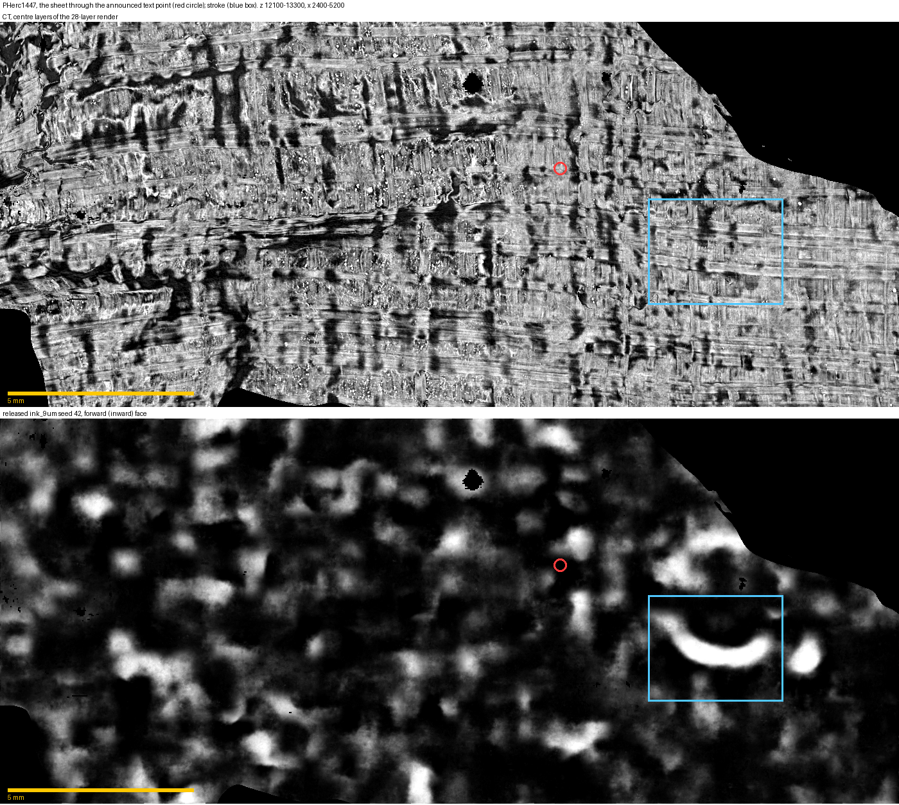
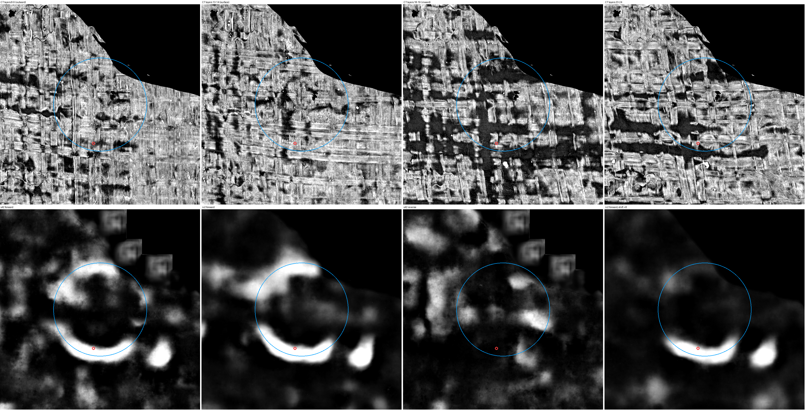
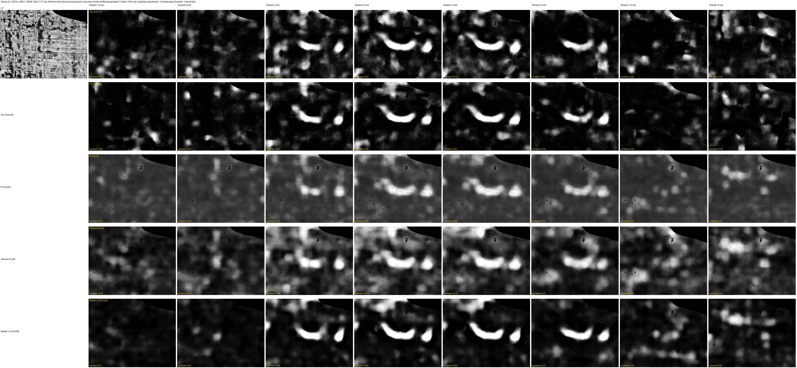
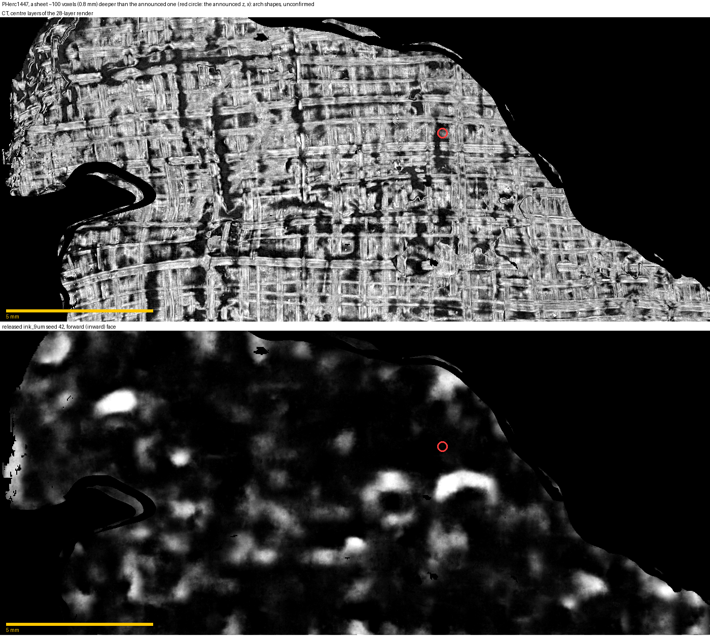

# pherc1447-text-site-control

Does the released `ink_9um` draw strokes on the eligible 1.2 m scan type? PHerc1447's public volume is an
8.64 µm / 1.2 m / 116 keV scan, the configuration of PHerc0800 and other First Letters volumes. The organisers
found text in it with a new recipe; their 24 Sep announcement places it at x 4144, y 2742, z 12557. This
repository tracks the papyrus sheet that passes through that point and runs five public 9 µm readers on it.

> **Correction, 29 Sep 2026.** The "U-shaped stroke" below is the lower arc of an **isolated ring about 3.4 mm
> across**. Bullo27 reported this ring first, on the team's segment `20250702235910`, as "One mark we could not
> explain": centre x 4656, y 2884, z 12652, drawn by all 14 released checkpoints on the forward face
> ([first-letters-survey](https://github.com/Bullo27/first-letters-survey), `analysis/pherc1447_ring/`). They read
> it as more likely structure than ink, mainly because it stands alone. Our 0.6 threshold split the ring into its
> lower and upper arcs, and the numbers below describe the lower arc (figure 4 shows the whole ring).
> kadenpool pointed this out in [issue #1](https://github.com/TAUIL-Abd-Elilah/pherc1447-text-site-control/issues/1).
> Whether the ring is ink or structure is open, so this is **not** the positive control
> [villa#1907](https://github.com/ScrollPrize/villa/issues/1907) asked for.

**Result.** On the sheet through the announced point, the one strong mark the readers draw is that ring, 4.7 mm
from the point (figures 1, 2, 4). We add these measurements of it:
- **Inward face only.** It is there on the face towards the scroll centre and not on the other face (as Bullo27
  found for the released checkpoints).
- **Depth-localised.** It is present with the render moved anywhere from 35 µm outward to 69 µm inward, and gone
  at 69 µm outward.
- **Seen by all five readers.** Both released seeds, our native-9 µm fine-tune, Chris Scheirer's fine-tune and
  KLAVIS's Reader v2 draw it, each only on the inward face. Reader v2 draws it most strongly (contrast +0.85).
- **Not an echo of a neighbouring turn.** The neighbouring sheets are about 14 voxels (120 µm) away on either side.
  An echo of their writing would grow toward them (Dreamskid's test on PHerc Paris 4). This mark fades toward both
  instead, to about 0 at ±16 voxels in every reader.
- **Rare elsewhere.** By one fixed rule (below) its lower arc is the only such mark in the 1.9 cm² of the sheet.
  The same rule finds **none in 119.7 cm²** of sheet-following renders of all 22 First Letters scrolls.

None of these tells ink from structure. A mark that is one-sided, thin in depth and isolated could be either a round
letter or an edge in the papyrus. We see no round void in the CT layers of figure 4, but at 8.64 µm that does not
rule structure out.

**What it is not.** The rest of the sheet reads as blobs. There is no legible text, and the mark has not been
matched to the organisers' reading. The rule was written after seeing the mark, so the comparison is exploratory.

**What is still useful here.**
- A tool: `src/bigsheet.py` tracks the sheet through any seed point from the public m7 prediction. It runs five
  readers on both faces and at depths out to the neighbouring sheets, in about 15 minutes of GPU time.
- The site checks and the stroke rule, with a 120 cm² comparison set from the eligible scrolls.
- A characterisation of the one strong mark at the announced site, for whoever settles what it is.


*Figure 1. The sheet through the announced point (red circle), 10.4 x 24.2 mm. Top: CT; bottom: released
ink_9um seed 42, inward face. Blue box: the lower arc of the ring (the "U").*


*Figure 4. 7.3 x 7.3 mm around the ring's centre (x 4656, z 12652) on our sheet. Top: CT at four depths (layer 13-14
is the surface; higher layers are inward). Bottom: seed 42 and Reader v2 on the inward face, seed 42 on the other
face, and Reader v2 with the render moved 8 voxels inward. Blue circle: Bullo27's ring (radius 1.7 mm). Red: the
centre of the "U" measured below.*


*Figure 2. The lower arc of the ring, for each of the five readers (rows), with the render moved along depth from -12 to +12
voxels (columns; 1 voxel = 8.64 µm; + = towards the scroll centre; the neighbouring sheets are ~14 voxels away)
and on the other face (last column). The number in each panel is the contrast:
mean prediction on the stroke minus a ring 10-40 px around it.*

## Numbers (`results/announced_sheet_checks.json`)

| reader | inward face, depth shift (voxels) -16 / -12 / -8 / -4 / **0** / +4 / +8 / +12 / +16 | other face, 0 |
|---|---|---|
| ink_9um seed 42 (released) | -0.00 / -0.03 / +0.04 / +0.53 / **+0.81** / +0.78 / +0.63 / +0.05 / -0.02 | +0.02 |
| ink_9um seed 43 (released) | +0.00 / +0.02 / +0.01 / +0.60 / **+0.80** / +0.81 / +0.58 / +0.03 / +0.01 | +0.02 |
| ft_b (native 9.362 µm fine-tune, [cross-scan-ink-transfer](https://github.com/TAUIL-Abd-Elilah/cross-scan-ink-transfer)) | +0.00 / +0.01 / +0.04 / +0.32 / **+0.47** / +0.46 / +0.37 / +0.11 / +0.00 | -0.00 |
| Scheirer ft_s42 ([reader-ft-s42](https://github.com/ShribyrLabs/vesuvius-reports/releases/tag/reader-ft-s42)) | +0.00 / +0.03 / +0.12 / +0.44 / **+0.54** / +0.54 / +0.47 / +0.21 / +0.06 | +0.04 |
| Reader v2 (KLAVIS, [reader-v2](https://github.com/DomRusso2/reader-v2)) | -0.02 / -0.01 / +0.07 / +0.65 / **+0.85** / +0.84 / +0.72 / +0.22 / +0.01 | -0.00 |

- **Where:** stroke centre at z 12815, y 2857, x 4628, 4.84 mm from the announced point in a straight line.
- **Size:** 3.08 x 1.37 mm (x by z), 20,369 px.
- **Shape:** stroke half-width 276 µm. Elongation (area / r², r = largest inscribed radius, the formula of #1907) is 20.0. A disc is 3.14; #1907 reports 16-25 for its human tracings and 10.6-15.3 for `ink_9um` maps on PHerc0841, with its own thresholding, so the comparison is approximate.

**The surface is the sheet through the announced point, and stays on it:**
- **At the point:** the tracked sheet's depth is y 2741.85 against the announced 2742 (-0.15 voxels). Neighbouring sheets here are about 14 voxels apart.
- **No jump:** along the straight path from the point to the stroke, the height map never steps more than 0.98 voxels between samples 1.37 voxels apart. A jump to the next sheet would be a step of about 14.
- **Never merges** with the deeper sheet of figure 3: the two stay 17-297 voxels apart (median 105).
- **Forward face points inward:** the centroid of the scroll cross-section at z 12557 is at y 3457, x 3915, so the +y face points to the scroll centre.

**The rule** (`src/stroke_null.py`): threshold the seed-42 map at 0.6, then keep components that pass all of these:
- area at least 5,000 px;
- elongation at least 15;
- not touching the rim of the valid surface;
- seed 43 agrees (its mean over the component is above 0.5);
- the other face is quiet (seed-42 mean over the component on the other face is below 0.2).

The null is 66 blocks (33 at 8.64 µm, 33 at 9.362 µm) on all 22 First Letters scrolls, rendered with the same tracker (`src/blockscan.py`), 119.7 cm² per face after removing a 48 px rim:
- 19 components pass area and elongation, 3 of them with elongation of 20 or more;
- none passes the full rule, and none of the 19 has seed 43 agreeing while clear of the rim.

Summary: `results/stroke_null_survey_summary.json`; block list: `runs/survey_blocks.txt`; rerun: `runs/04_null_survey.sh`. One mark passes in total. If the rule fired at the same rate everywhere, the chance that it would land in the 3.2 cm² rendered at the text site (this sheet plus the deeper one) is 3.2 / 122.9 = 2.6 %.

## A deeper sheet: arch shapes, unconfirmed


*Figure 3. A sheet about 100 voxels (0.8 mm) deeper, over the same box; the red circle marks the announced (z, x).
The released readers draw two arch shapes below and to the right of it.*

We found these arches first and at first took them for the announced text; they are not on the announced sheet.
Both are on the inward face only (other-face contrast 0.03 or less) and all five readers draw them, but they are
compact (elongation 10.3 and 6.8), their depth profiles differ (one still +0.40 at -8 voxels, the other +0.41 at
+8), and other blobs on this sheet are one-sided too. They do not pass the rule above, and nothing is known to be
written on that sheet, so they are reported, not claimed.

## Reproduce

Needs a CUDA GPU (~6 GB) and about 2.4 GB of CT chunks plus the m7 surface prediction for the box. The first
version (four readers, five depths) took 12 minutes on an RTX 3090 with the data cached; the current nine depths
and five readers are about 2.5 times the work.
The code needs:
- a [ScrollPrize/villa](https://github.com/ScrollPrize/villa) checkout for `vesuvius.ink_detection.inference.infer` (tested at `5479453a7`; `main` at `f4570bfa6` has the same flags);
- the checkpoints listed in `runs/env.sh`.

```bash
source runs/env.sh                 # set VILLA_SRC, INK9UM_CKPTS, FTB_CKPT, SCH_CKPT, CT_CACHE, OUT
bash runs/01_announced_sheet.sh    # track the sheet through (z 12557, x 4144, y 2742), render, 5 readers, 8 depth shifts
bash runs/02_deeper_sheet.sh       # the deeper sheet (figure 3)
bash runs/03_checks_and_figures.sh # results/*.json and figures/
bash runs/04_null_survey.sh        # the 66-block comparison set (~30 GB of CT, several GPU hours)
```

Every result and figure here was produced by these scripts. A from-scratch rerun of the first version (four readers,
five depths) reproduced the height maps, the readers' maps, the numbers and the figures bit for bit; so did one
block of step 4 (PHerc0358, 9 sheets).

**The code (`src/`):**
- `sheet_grow.py`: best-first growth of one sheet over the run centres of the organisers' m7 surface-prediction mask, snapped to full resolution.
- `bigsheet.py`: one sheet from a seed point over a box, rendered as a 28-layer stack along the depth axis; `--shift` moves the stack along depth.
- `blockscan.py`: every sheet in a block.
- `infer_sheets.py`: runs the readers through villa's inference CLI, both faces.
- `site_checks.py`: every number above.
- `stroke_null.py`: the rule, on any set of renders.
- `figures.py`, `view_bigsheet.py`.
- `zfetch.py` and `fetch_pred.py`: cached reads of the public zarrs.

**Credits:**
- `ink_9um` and the m7 surface predictions: Vesuvius Challenge (huggingface.co/scrollprize/ink_9um).
- The `reader-ft-s42` fine-tune: Chris Scheirer (MIT).
- Reader v2: KLAVIS / Domenico Russo (MIT, huggingface.co/domenicor046/reader-v2).
- The echo test: Dreamskid's depth-echo analysis of PHerc Paris 4.
- The elongation formula: villa#1907.

MIT licence. Data: Vesuvius Challenge, CC BY-NC 4.0.
Developed with AI assistance under my direction.
